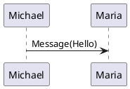
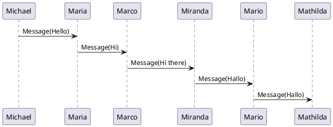

# Plantuml Static integrations
These integrations use a markdown code block with specific languages
```
@startuml
Michael -> Maria : Message(Hello)
@enduml
```

## Remark Plantuml Astro Component
This code is using `plantuml` code.



## Remark Plantuml Svg
This code is using `plantuml` code.


## Large sequence


